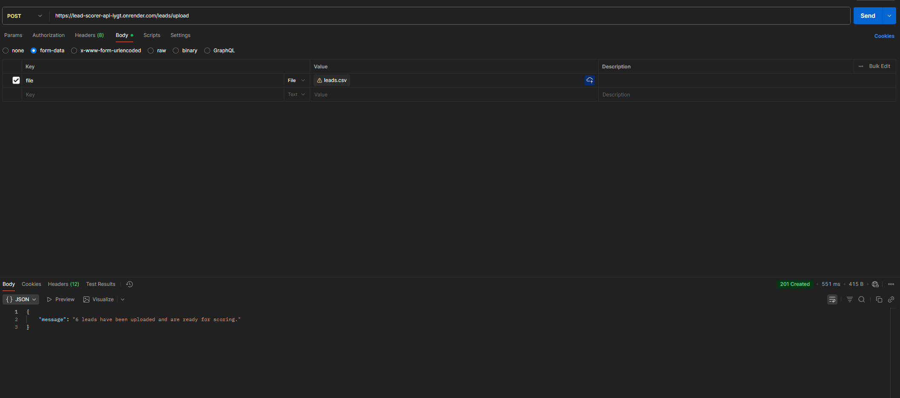

# AI-Powered Lead Scoring API

[](https://lead-scorer-api-iygt.onrender.com/)


A backend service designed for a hiring assignment that accepts product information and a list of leads, then scores each lead's buying intent using a dual-layer pipeline of rule-based logic and AI-powered reasoning from Google's Gemini API.

## Features

-   **RESTful API:** Clean, well-documented API endpoints for managing offers and leads.
-   **CSV Upload:** Easily upload leads in bulk via a CSV file.
-   **Dual-Layer Scoring Pipeline:**
    1.  **Rule-Based Logic (Max 50 points):** Scores leads based on objective criteria like role relevance, industry match, and data completeness.
    2.  **AI-Powered Reasoning (Max 50 points):** Utilizes the Google Gemini API to analyze the lead's profile against the product offer, providing an intent classification (High/Medium/Low) and a qualitative reason.
-   **Flexible Output:** Retrieve scored results in either JSON format or as a downloadable CSV file.
-   **Containerized:** Fully containerized with Docker for consistent, portable, and scalable deployments.

## Tech Stack

-   **Backend:** Flask, Gunicorn
-   **Database:** SQLite with Flask-SQLAlchemy ORM
-   **AI Integration:** Google Gemini API (`gemini-1.0-pro`)
-   **Data Handling:** Pandas
-   **Containerization:** Docker

## API Endpoints

The live base URL for all endpoints is `https://lead-scorer-api-iygt.onrender.com`.

| Method | Endpoint             | Description                                          | Request Body / Form Data                                     | Success Response                                                                |
| :----- | :------------------- | :--------------------------------------------------- | :----------------------------------------------------------- | :------------------------------------------------------------------------------ |
| `POST` | `/offer`             | Sets the product/offer details for scoring.          | `Content-Type: application/json` <br> See [JSON Example](#offer-json-example). | `201 Created` - Offer details set successfully.                               |
| `POST` | `/leads/upload`      | Uploads a CSV file of leads to be scored.            | `Content-Type: multipart/form-data` <br> **Key:** `file` <br> **Value:** Your `leads.csv` file. | `201 Created` - `X leads have been uploaded and are ready for scoring.`       |
| `POST` | `/score`             | Triggers the scoring pipeline for all uploaded leads. | (No body required)                                           | `200 OK` - `Successfully scored X leads.`                                       |
| `GET`  | `/results`           | Retrieves all scored leads in JSON format.           | (No body required)                                           | `200 OK` - An array of scored lead objects.                                     |
| `GET`  | `/results/csv`       | Exports all scored leads as a downloadable CSV file. | (No body required)                                           | `200 OK` - A `scored_leads.csv` file is downloaded.                             |

---

## Local Setup and Installation

Follow these steps to set up and run the project on your local machine.

### 1. Prerequisites

-   Python 3.9+
-   `pip` (Python package installer)
-   Git

### 2. Installation

1.  **Clone the repository:**
    ```bash
    git clone <your-repository-url>
    cd lead_scorer
    ```

2.  **Create and activate a virtual environment:**
    -   **Windows (CMD/PowerShell):**
        ```bash
        python -m venv venv
        .\venv\Scripts\activate
        ```
    -   **macOS/Linux:**
        ```bash
        python3 -m venv venv
        source venv/bin/activate
        ```

3.  **Install dependencies:**
    ```bash
    pip install -r requirements.txt
    ```

4.  **Set up environment variables:**
    -   Create a file named `.env` in the project root.
    -   Add your Google Gemini API key to this file:
        ```env
        GEMINI_API_KEY="your_gemini_api_key_here"
        ```

5.  **Run the application:**
    ```bash
    python app.py
    ```
    The application will start, and the `database.db` file will be created automatically. The server will be running at `http://127.0.0.1:5000`.

---

## How to Use (Testing Workflow)

Use an API client like [Postman](https://www.postman.com/) or `cURL` to interact with the endpoints in the following order. Replace `http://127.0.0.1:5000` with the live URL `https://lead-scorer-api-iygt.onrender.com` when testing the deployed version.

1.  **Set the Offer:**
    -   Create a file `offer.json` with your product details.
    -   Send the request:
        ```bash
        curl -X POST -H "Content-Type: application/json" --data @offer.json [https://lead-scorer-api-iygt.onrender.com/offer](https://lead-scorer-api-iygt.onrender.com/offer)
        ```

2.  **Upload Leads:**
    -   Ensure you have a `leads.csv` file in your directory.
    -   Send the request:
        ```bash
        curl -X POST -F "file=@leads.csv" [https://lead-scorer-api-iygt.onrender.com/leads/upload](https://lead-scorer-api-iygt.onrender.com/leads/upload)
        ```

3.  **Trigger Scoring:**
    ```bash
    curl -X POST [https://lead-scorer-api-iygt.onrender.com/score](https://lead-scorer-api-iygt.onrender.com/score)
    ```

4.  **Get Results:**
    -   **JSON:**
        ```bash
        curl [https://lead-scorer-api-iygt.onrender.com/results](https://lead-scorer-api-iygt.onrender.com/results)
        ```
    -   **CSV:**
        ```bash
        curl [https://lead-scorer-api-iygt.onrender.com/results/csv](https://lead-scorer-api-iygt.onrender.com/results/csv) --output scored_leads.csv
        ```

### Offer JSON Example
(`offer.json`)
```json
{
  "name": "AI Outreach Automation",
  "value_props": [
    "24/7 outreach",
    "6x more meetings booked automatically"
  ],
  "ideal_use_cases": [
    "B2B SaaS",
    "Sales Teams",
    "Marketing Agencies"
  ]
}
```

---

## Docker Setup (Local)

You can also run this application within a Docker container for a more isolated environment.

### 1. Prerequisites

-   [Docker Desktop](https://www.docker.com/products/docker-desktop/) installed and running.

### 2. Build and Run

1.  **Build the Docker image:**
    ```bash
    docker build -t lead-scorer .
    ```

2.  **Run the Docker container:**
    ```bash
    docker run -p 5001:5000 --env-file .env lead-scorer
    ```
    The application will now be accessible at `http://127.0.0.1:5001`.

## Deployment

[](https://lead-scorer-api-iygt.onrender.com/)

This application has been successfully deployed on Render and is live.

-   **Live API Base URL:** `https://lead-scorer-api-iygt.onrender.com`

You can use this base URL with tools like Postman to interact with the live API endpoints. For example, to get the results, the endpoint would be `https://lead-scorer-api-iygt.onrender.com/results`.

---

## Screenshots

Here are a few examples of the API in action using the live deployed endpoints in Postman.

### 1. Setting the Offer Details (`POST /offer`)


### 2. Uploading the Leads CSV (`POST /leads/upload`)


### 3. Viewing the Scored Results (`GET /results`)


---